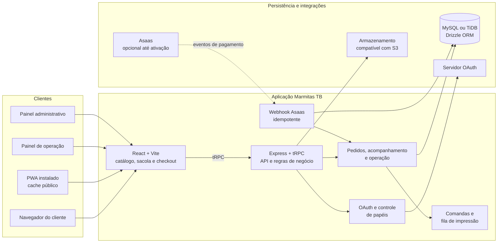

# Diagrama de Arquitetura e CI com Artefato Implementation Plan

> **For agentic workers:** REQUIRED SUB-SKILL: Use superpowers:subagent-driven-development (recommended) or superpowers:executing-plans to implement this plan task-by-task. Steps use checkbox (`- [ ]`) syntax for tracking.

**Goal:** Documentar a arquitetura da Marmitas TB no README e validar automaticamente cada alteração do projeto com GitHub Actions, disponibilizando o build aprovado como artefato.

**Architecture:** O README de `marmitastb/` terá um diagrama Mermaid orientado por camadas para comunicar o limite entre clientes, aplicação e serviços externos. Um único workflow no repositório host será disparado somente por alterações que afetem a aplicação ou a automação; ele executará a cadeia de qualidade no diretório do projeto e publicará `dist/` apenas quando todos os comandos tiverem sucesso.

**Tech Stack:** Mermaid, Markdown, YAML, GitHub Actions, Node.js 22, Corepack/pnpm, Vitest, TypeScript, Vite.

---

## Estrutura de arquivos

| Arquivo | Responsabilidade |
| --- | --- |
| `/home/ubuntu/github-exports/marmitastb-host/marmitastb/README.md` | Documentar a arquitetura em Mermaid, com legenda e limites de cache/PWA. |
| `/home/ubuntu/github-exports/marmitastb-host/.github/workflows/ci.yml` | Validar instalação, testes, tipos e build; publicar o artefato aprovado. |
| `/home/ubuntu/marmitas-tb-delivery/docs/superpowers/specs/2026-08-18-arquitetura-ci-design.md` | Referência de requisitos já aprovada; não modificar durante a execução. |

### Task 1: Inserir e validar o diagrama de arquitetura

**Files:**
- Modify: `/home/ubuntu/github-exports/marmitastb-host/marmitastb/README.md: após a seção "Visão geral"`
- Test: renderização local do bloco Mermaid no README

- [ ] **Step 1: Inserir uma seção de arquitetura após a tabela de visão geral**

Adicionar o texto explicativo e o diagrama abaixo antes de `## Capturas de tela`.

````markdown
## Arquitetura

O diagrama apresenta os limites entre a experiência do cliente, o servidor da aplicação e os serviços que persistem ou integram dados. As setas contínuas representam chamadas da aplicação; a seta tracejada indica o webhook externo de pagamentos. O bloco Asaas permanece opcional enquanto o modo oficial não estiver ativado.



> **Cache PWA:** somente recursos públicos já carregados podem ser reutilizados offline. Checkout, rastreamento atual, pagamentos, operação e administração dependem da API em rede para evitar dados desatualizados ou ações duplicadas.
````

- [ ] **Step 2: Renderizar o diagrama para verificar sua sintaxe**

Run:

```bash
cd /home/ubuntu/github-exports/marmitastb-host/marmitastb
manus-render-diagram README.md /tmp/marmitastb-architecture.png
test -s /tmp/marmitastb-architecture.png
```

Expected: exit code `0` e arquivo PNG não vazio, confirmando que o Mermaid do README pode ser renderizado.

- [ ] **Step 3: Confirmar os termos e limites documentados**

Run:

```bash
cd /home/ubuntu/github-exports/marmitastb-host
grep -F "Cache PWA" marmitastb/README.md
grep -F "Webhook Asaas" marmitastb/README.md
git diff --check -- marmitastb/README.md
```

Expected: as duas linhas são localizadas e `git diff --check` não reporta whitespace inválido.

### Task 2: Criar o workflow de CI e artefato

**Files:**
- Create: `/home/ubuntu/github-exports/marmitastb-host/.github/workflows/ci.yml`
- Test: validação YAML e execução local dos mesmos comandos do job

- [ ] **Step 1: Criar o workflow com gatilhos restritos, permissões mínimas e concorrência**

Criar o arquivo com o conteúdo completo abaixo.

```yaml
name: Validar Marmitas TB

on:
  push:
    paths:
      - "marmitastb/**"
      - ".github/workflows/ci.yml"
  pull_request:
    paths:
      - "marmitastb/**"
      - ".github/workflows/ci.yml"

permissions:
  contents: read

concurrency:
  group: marmitastb-ci-${{ github.workflow }}-${{ github.ref }}
  cancel-in-progress: true

jobs:
  validate:
    name: Testes, tipos e build
    runs-on: ubuntu-latest
    defaults:
      run:
        working-directory: marmitastb

    steps:
      - name: Obter código
        uses: actions/checkout@v4

      - name: Configurar pnpm
        uses: pnpm/action-setup@v4
        with:
          version: 10.4.1

      - name: Configurar Node.js
        uses: actions/setup-node@v4
        with:
          node-version: 22
          cache: pnpm
          cache-dependency-path: marmitastb/pnpm-lock.yaml

      - name: Instalar dependências pelo lockfile
        run: pnpm install --frozen-lockfile

      - name: Executar testes
        run: pnpm test

      - name: Verificar tipos
        run: pnpm check

      - name: Gerar build de produção
        run: pnpm build

      - name: Publicar build validado
        uses: actions/upload-artifact@v4
        with:
          name: marmitastb-dist-${{ github.sha }}
          path: marmitastb/dist
          if-no-files-found: error
          retention-days: 7
```

- [ ] **Step 2: Validar a estrutura YAML e as escolhas de segurança**

Run:

```bash
cd /home/ubuntu/github-exports/marmitastb-host
ruby -e 'require "yaml"; YAML.load_file(".github/workflows/ci.yml"); puts "YAML válido"'
grep -F "contents: read" .github/workflows/ci.yml
grep -F "retention-days: 7" .github/workflows/ci.yml
```

Expected: `YAML válido`, a permissão de leitura e a retenção limitada do artefato são encontradas.

- [ ] **Step 3: Executar localmente a mesma cadeia de qualidade do workflow**

Run:

```bash
cd /home/ubuntu/github-exports/marmitastb-host/marmitastb
pnpm install --frozen-lockfile
pnpm test
pnpm check
pnpm build
test -d dist
```

Expected: todos os comandos retornam `0` e `dist/` existe ao final.

### Task 3: Publicar e verificar a execução remota

**Files:**
- Modify: `/home/ubuntu/github-exports/marmitastb-host/marmitastb/README.md`
- Create: `/home/ubuntu/github-exports/marmitastb-host/.github/workflows/ci.yml`
- Test: execução do GitHub Actions e consulta do artefato

- [ ] **Step 1: Revisar somente os arquivos esperados**

Run:

```bash
cd /home/ubuntu/github-exports/marmitastb-host
git diff --check
git status --short
```

Expected: nenhum erro de whitespace e alterações limitadas a `marmitastb/README.md` e `.github/workflows/ci.yml`.

- [ ] **Step 2: Versionar e enviar a documentação e a automação**

Run:

```bash
cd /home/ubuntu/github-exports/marmitastb-host
git add marmitastb/README.md .github/workflows/ci.yml
git commit -m "ci: valida Marmitas TB e publica build"
git push origin main
```

Expected: o commit é aceito e `git push` atualiza `origin/main`.

- [ ] **Step 3: Consultar a execução e o artefato do GitHub Actions**

Run:

```bash
RUN_ID=$(gh run list --repo Alves1986/ministral --workflow ci.yml --limit 1 --json databaseId --jq '.[0].databaseId')
gh run watch "$RUN_ID" --repo Alves1986/ministral --exit-status
```

Expected: execução aprovada e artefato `marmitastb-dist-<sha>` disponível na página da execução.
