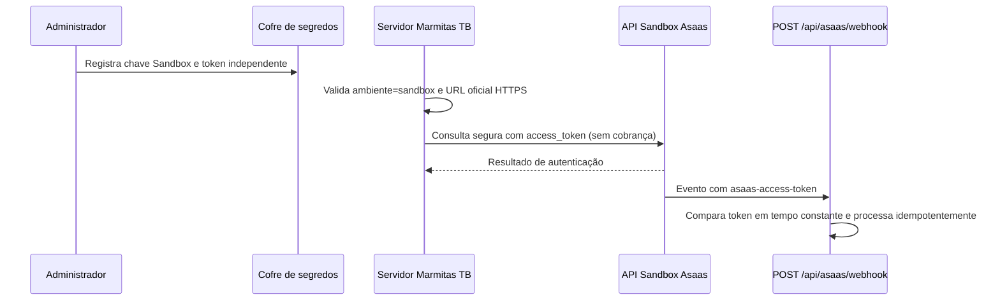

# Homologação segura do Asaas — desenho técnico

**Status:** aprovado em princípio pelo usuário em 18 de agosto de 2026; aguardando revisão desta especificação antes da implementação.

## Objetivo e limites

Esta entrega conecta a Marmitas TB exclusivamente ao **Sandbox do Asaas**, mantendo a loja no modo de pagamento de teste até que a homologação seja verificada. Nenhuma credencial de Produção será solicitada, armazenada ou aceita neste escopo. Nenhuma cobrança real será criada.

O Asaas define o Sandbox como ambiente independente de Produção, com URL base `https://api-sandbox.asaas.com/v3` e chave própria; esse ambiente permite homologar pagamentos e webhooks sem movimentar valores reais. [1]

## Configuração privada

| Variável | Classificação | Regra de uso |
| --- | --- | --- |
| `ASAAS_ENVIRONMENT` | Configuração de servidor | Valor obrigatório: `sandbox`. Qualquer outro valor será recusado nesta fase. |
| `ASAAS_API_URL` | Configuração de servidor | Opcional; na ausência, usa a URL oficial do Sandbox. Só será aceita a origem oficial HTTPS do Sandbox. |
| `ASAAS_API_KEY` | Segredo | Chave exclusiva do Sandbox, nunca enviada ao cliente, adicionada ao cabeçalho `access_token` somente pelo servidor. |
| `ASAAS_WEBHOOK_TOKEN` | Segredo | Token independente, com 32–255 caracteres, usado exclusivamente para validar o cabeçalho `asaas-access-token`. |

As credenciais serão solicitadas por formulário protegido e não serão gravadas em arquivos `.env`, commits, documentação pública, logs ou variáveis prefixadas com `VITE_`. A chave da API e o token de webhook não poderão ter o mesmo valor. O Asaas recomenda expressamente manter chaves fora do código, do frontend e dos logs. [2]

## Componentes e fluxo

O módulo central `server/_core/env.ts` passará a expor uma configuração do Asaas validada no processo de inicialização. Ele preservará as variáveis como opcionais para o desenvolvimento local, mas classificará a integração como não pronta quando faltar uma variável, a URL for inválida ou o ambiente for diferente de `sandbox`.

O adaptador oficial continuará indisponível por padrão. Quando a configuração estiver pronta, ele receberá a configuração explicitamente e fará requisições apenas ao endpoint Sandbox com os cabeçalhos `access_token`, `Content-Type: application/json` e `User-Agent: marmitas-tb-delivery`. A primeira comprovação de conectividade será uma consulta de conta sem criação de cliente, cobrança ou pagamento. A falha de autenticação, URL, rede ou resposta inválida será traduzida em erro seguro e sem inclusão de segredos.

O endpoint `POST /api/asaas/webhook` manterá a validação em tempo constante do token separado. Nenhum evento será aceito com token ausente, diferente ou configurado incorretamente. O processamento idempotente de eventos já existente será preservado, pois a entrega do Asaas segue o modelo *at least once*. [3]

## Proteções contra ativação indevida

| Situação | Comportamento obrigatório |
| --- | --- |
| `ASAAS_ENVIRONMENT` ausente ou diferente de `sandbox` | Integração indisponível, sem tentativa de rede. |
| URL diferente de `https://api-sandbox.asaas.com/v3` | Integração indisponível, sem tentativa de rede. |
| Chave ou token ausente | Integração indisponível, sem tentativa de rede. |
| Chave e token idênticos | Integração indisponível, sem tentativa de rede. |
| Loja no modo `test` | Mantém o adaptador simulado e não chama o Asaas. |
| Loja no modo `asaas` sem validação Sandbox aprovada | Retorna erro explícito, sem criar cobrança. |

## Estratégia de testes e aceite

Os testes serão escritos antes da implementação. Eles cobrirão: configuração completa de Sandbox; bloqueio para Produção, URL não permitida e segredos incompletos; ausência de vazamento da chave em mensagens de erro; seleção contínua do adaptador simulado no modo `test`; e validação de token de webhook independente.

A validação final terá três camadas: suíte Vitest, `pnpm check` e `pnpm build`. Depois do segredo ser incluído, uma verificação server-side sem cobrança confirmará apenas se a autenticação do Sandbox é aceita. A configuração do webhook no painel do Asaas permanecerá uma ação manual do administrador, com a URL HTTPS publicada e o mesmo token protegido. O endpoint deve responder rapidamente com 2xx e continuar idempotente, conforme as orientações do Asaas. [3]

## Fora do escopo

Ativação de Produção, chave de Produção, cobrança real, cadastro de contatos de terceiros, alteração automática do modo de pagamento da loja, criação automática de webhook e publicação de segredos no GitHub não fazem parte desta entrega.

## Referências

[1] [Asaas — Teste sua integração no Sandbox](https://docs.asaas.com/docs/sandbox)

[2] [Asaas — Authentication](https://docs.asaas.com/docs/authentication-2)

[3] [Asaas — Receive events from a webhook endpoint](https://docs.asaas.com/docs/receive-asaas-events-at-your-webhook-endpoint)
