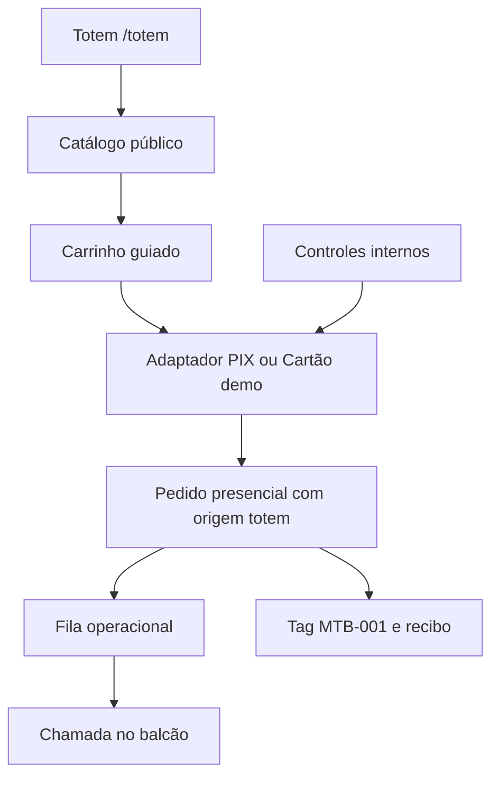

# Especificação de Design — Totem de Pedidos Rápidos Marmitas TB

**Status:** Aprovada para planejamento técnico em 21 de agosto de 2026.  
**Escopo:** Autoatendimento presencial para retirada no balcão, em orientação vertical, integrado ao catálogo e à operação existentes.

## 1. Objetivo e princípio de experiência

O totem reduz a fila para pessoas que desejam escolher, pagar e receber uma senha de retirada sem aguardar atendimento inicial no balcão. Ele será acessível por uma rota pública dedicada, `/totem`, e deverá funcionar tanto em tablet quanto em monitor touch conectado por rede, sem conceder acesso à gestão administrativa.

> **Regra de ouro:** o cliente conclui um pedido de retirada em poucos passos, sempre sabe em que etapa está e não precisa criar conta, informar telefone ou preencher dados pessoais obrigatórios.

## 2. Fluxo aprovado

| Etapa | Tela e ação do cliente | Resultado operacional |
|---|---|---|
| 1. Boas-vindas | Toca em “Começar pedido”. | Inicia um carrinho novo de origem `totem`. |
| 2. Categorias | Seleciona uma categoria do catálogo ativo. | O totem mantém somente categorias e produtos disponíveis. |
| 3. Marmitas | Escolhe a marmita e suas opções obrigatórias ou opcionais. | Reaproveita as regras de catálogo e preço existentes. |
| 4. Bebida | Escolhe uma bebida ou avança sem bebida. | Adiciona opcional compatível ao carrinho. |
| 5. Sobremesa | Escolhe uma sobremesa ou avança sem sobremesa. | Adiciona opcional compatível ao carrinho. |
| 6. Nome opcional | Pode digitar apenas o primeiro nome. | O nome é usado exclusivamente na chamada/recibo do pedido. |
| 7. Revisão | Confere itens, quantidades e total. | Permite voltar e corrigir qualquer etapa antes do pagamento. |
| 8. Pagamento | Escolhe PIX ou cartão em modo de demonstração. | Simula autorização, sem cobrança nem transmissão de dados de cartão. |
| 9. Confirmação | Recebe senha de retirada e recibo. | Cria pedido do totem na fila e permite chamada no balcão. |

## 3. Identidade visual e interação por toque

Todas as telas exibem a logo da Marmitas TB em um cabeçalho fixo, com cores, tipografia e tom visual consistentes com a vitrine atual. O cabeçalho também mostra o estado do pedido e um indicador discreto de progresso. Os controles de toque terão áreas generosas, contraste suficiente e texto direto, pois o terminal será usado em pé e por pessoas com diferentes níveis de familiaridade digital.

| Elemento | Especificação |
|---|---|
| Orientação | Vertical, com primeiro breakpoint destinado a tablets e monitores touch estreitos. |
| Marca | Logo Marmitas TB visível em todas as telas, sem competir com os controles de pedido. |
| Navegação | Botão “Voltar” sempre disponível após a primeira escolha; resumo persistente e editável. |
| Acessibilidade | Alvos de toque amplos, textos legíveis, contraste e feedback visível para cada seleção. |
| Inatividade | Aviso antes de expirar; limpeza integral de carrinho, nome e estado de pagamento, seguida de retorno à tela inicial. |

## 4. Pagamento presencial em modo demonstração

O totem apresenta as opções **PIX** e **Cartão**, mas nesta primeira etapa ambos são demonstrativos. O cartão reproduz a comunicação esperada de uma máquina real (“aproxime ou insira o cartão”) e aprova automaticamente após três segundos de processamento. O PIX exibe um QR demonstrativo e confirma automaticamente após três segundos, sem gerar cobrança, QR bancário real ou dado financeiro.

| Modalidade | Experiência do cliente | Estado da integração |
|---|---|---|
| Cartão | Tela de processamento e aprovação automática. | Adaptador de terminal simulado, substituível por fornecedor futuro. |
| PIX | QR de demonstração e confirmação automática. | Adaptador de PIX simulado, preparado para o Sandbox/produção do Asaas após autorização. |
| Cenários de teste | Aprovado, recusado ou pendente. | Controles restritos a `staff` e `admin`; o cliente não pode alterar o resultado. |

Nenhuma integração real será ativada, nenhuma credencial será cadastrada e nenhum pagamento será enviado durante a demonstração. A futura fornecedora da máquina de cartão permanece **a definir**. O contrato de integração deverá isolar cada fornecedor por um adaptador, sem alterar a experiência da tela do totem.

## 5. Senha, chamada e recibo

Após a confirmação demonstrativa do pagamento, o sistema gera uma senha curta sequencial diária no padrão `MTB-001`; a sequência recomeça em `MTB-001` a cada novo dia operacional. Se o cliente informar nome, a identificação visual passa a ser `MTB-001 · ANDERSON`; caso contrário, exibe apenas `MTB-001`. A mesma tag é disponibilizada para a operação e usada pelo balcão na chamada de retirada.

O recibo terá a tag, itens, total demonstrativo, data/hora e a indicação clara de “Pagamento em demonstração” enquanto as integrações reais não estiverem habilitadas. O primeiro mecanismo de impressão será uma visualização otimizada para impressão do navegador. A impressão automática sem diálogo dependerá da configuração de modo quiosque ou de um conector local do dispositivo, que não será presumido nesta fase.

## 6. Modelo de dados e integração com a operação

O totem reutiliza o catálogo, preços e composição de pedido existentes. Um pedido confirmado pelo fluxo demonstrativo deve registrar sua origem como `totem`, sua modalidade como `pix_demo` ou `card_demo`, seu status de pagamento como demonstrativo e seu status operacional como pronto para a fila. Esses valores preservam a capacidade de filtrar pedidos de apresentação e impedem que relatórios financeiros os tratem como receita recebida.

## 7. Segurança e estados de erro

O totem não mostrará links de administração, detalhes de outros pedidos, dados de cliente ou controles internos. Falhas de rede, indisponibilidade de catálogo, pagamento pendente ou erro de criação de pedido deverão preservar o carrinho enquanto houver recuperação possível e orientar a equipe sem apresentar detalhes técnicos ao cliente. Em caso de cancelamento ou inatividade, todos os dados temporários são limpos do dispositivo.

## 8. Critérios de aceitação

| Critério | Evidência esperada |
|---|---|
| Jornada guiada | Cliente percorre categoria, marmita, bebida, sobremesa, nome opcional, revisão e pagamento. |
| Identidade | Logo e identidade Marmitas TB aparecem em todos os estados da rota `/totem`. |
| Demonstração segura | PIX e cartão simulam aprovação sem criar cobrança, sem usar credenciais e sem registrar receita real. |
| Fila | Pedido demonstrativo entra identificado como origem `totem` e pode ser chamado pela tag. |
| Recibo | A confirmação produz uma visualização de impressão contendo tag e nome opcional. |
| Quiosque | Em tela vertical, a rota limpa a sessão por inatividade e não expõe áreas internas. |
| Regressão | Catálogo web, checkout atual, operação e painel administrativo continuam funcionando. |

## 9. Deliberações posteriores

A escolha da marca/modelo da máquina de cartão, o cadastro das credenciais Asaas e a ativação de cobrança real ficam explicitamente fora desta implementação. Qualquer mudança para pagamento real exigirá aprovação específica, configuração segura de credenciais, homologação e novo teste controlado.
